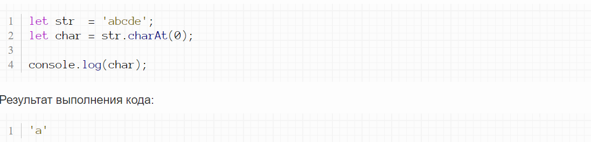
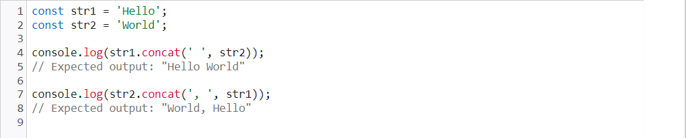
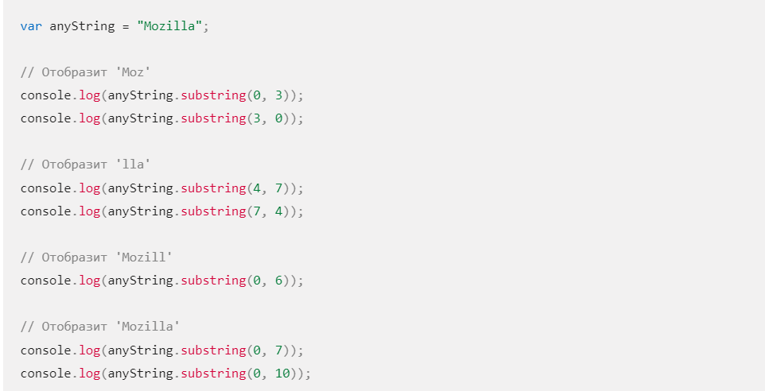
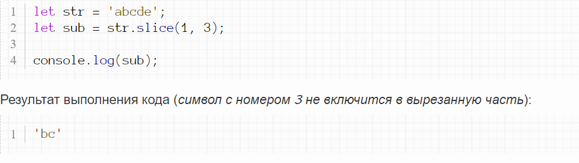
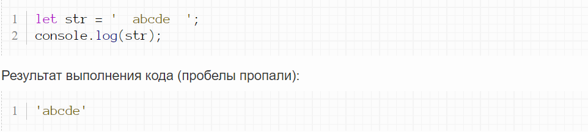
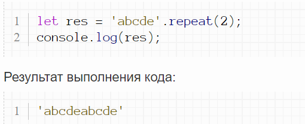

 # Mетоды JavaScript для (string) 
 # Что такой метод?
### Методы массива в JavaScript — это встроенные функции, которые можно использовать для манипулирования элементами, включая их поиск, сортировку, фильтрацию и другие операции.  

# Способы создания (string)
### В JavaScript есть разные типы кавычек.

 ### Строку можно создать с помощью одинарных, двойных либо обратных кавычек:
 
 ## Одинарные и двойные кавычки работают, по сути, одинаково, а если использовать обратные кавычки, то в такую строку мы сможем вставлять произвольные выражения, обернув их в ${…}:
    

  # Метод charAt
  ### Метод charAt возвращает символ, стоящий на указанной позиции в строке. Позиция задается параметром метода (нумерация начинается с нуля). Если указанная позиция больше позиции последнего символа - вернется пустая строка.
  # Пример 1
  ### Давайте выведем символ, стоящий на нулевой позиции:
     

   # Пример 2
  ### Сейчас будет выведена пустая строка, так как веденная позиция больше, чем позиция последнего символа:
       

 # Метод at
 ### Метод at осуществляет поиск символа по номеру его позиции в строке. В параметре метода мы указываем целое число, которое может быть положительным или отрицательным (в этом случае поиск ведется с конца строки).
 # Пример 1
  ### Давайте узнаем какой символ находится в строке под номером 0:
     
 
 # Пример 2
  ### Давайте узнаем какой символ находится в строке под номером -1:
     
 # Метод concat
 ### Метод concat() значений String объединяет строковые аргументы в данную строку и возвращает новую строку. 
   

 # Метод replace
 ### Метод replace осуществляет поиск и замену частей строки. Первым параметром принимается регулярное выражение, а вторым - подстрока, на которую заменяем.
# Пример 1
  ### Давайте найдем и заменим символ 'a':
     

   # Пример 2
  ### По умолчанию заменяется только первое совпадение. Давайте снова заменим символ 'a' в строке:
   
   # Метод replace all
 ### Метод replaceAll()значений Stringвозвращает новую строку, в которой все совпадения a patternзаменены на a replacement. The patternможет быть строкой или a RegExp, а the replacementможет быть строкой или функцией, которая будет вызываться для каждого совпадения. Исходная строка остается неизменной.   
# Пример
  
 # Метод split
 ### Метод split разбивает строку в массив по разделителю в виде с регулярного выражения.

 ### Первым параметром метод принимает регулярку, а вторым необязательным параметром - максимальное количество элементов в получившемся массиве.
 # Пример 1
  ### Давайте разобьем строку в массив по разделителю '-' или по разделителю '+':
     
 
 # Пример 2
  ### Давайте ограничим количество элементов в получившемся массиве:
     
# Метод substring
### Метод substring() возвращает подстроку строки между двумя индексами, или от одного индекса и до конца строки.
# Пример
  
  # Метод slice
### Метод slice возвращает подстроку из строки (исходная строка при этом не изменяется). Первым параметром указывается номер символа строки, с которого начинается вырезание, а вторым параметром - номер символа, на котором закончится вырезание (при этом символ с этим номером не включится в вырезанную часть). Второй параметр не является обязательным. Если его не указать - подстрока возьмется с указанного в первом параметре символа до конца строки. Он также может принимать отрицательные значения. В этом случае отсчет символа, на котором закончится обрезание, начинается с конца строки. Последний символ имеет номер -1.
# Пример
  
  # Метод toLowerCase
 ### Метод toLowerCase преобразует символы строки в нижний регистр (из больших букв делает маленькие). При этом мы получаем новую строку, а исходная строка остается неизменной.
# Пример 1
  ### Давайте преобразуем все большие буквы строки в маленькие:
     
 
 # Пример 2
  ### Комбинируя метод toLowerCase и метод slice можно задать нижний регистр для отдельных частей строки:
     
   ## Метод touppercase делает всё иначе !
# Метод trim
 ### Метод trim удаляет пробелы по краям строки. Чаще всего это нужно при вводе пользователем каких-либо значений: он может случайно налепить лишних пробелов - и наша задача очистить введенный текст от них.

 # Пример 1
  ### Давайте удалим концевые пробелы у строки:
     

   # Метод includes
 ### Метод includes выполняет поиск заданной строки в текущей с учетом регистра. Первым параметром метод принимает строку, которую нужно найти, вторым необязательным - позицию, с которой нужно начинать поиск. После выполнения метод возвращает true или false.

 # Пример 1
  ### Давайте проверим, есть ли строка 'ab' в строке 'abcde':
     
 # Пример 2
  ### Теперь давайте проведем поиск с пятого символа текущей строки:
     
  # Метод toSrting
 ### Метод toString() преобразует число в строку в указанной системе счисления. По умолчанию используется десятичная система счисления.

 # Метод indexOf

 ### Метод indexOf осуществляет поиск подстроки в строке. В первом параметре указываем искомую подстроку в нужном нам регистре (большие буквы или маленькие). Метод вернет позицию первого совпадения, а если оно не найдено, то вернет -1. Вторым необязательным параметром можно передать номер символа, откуда следует начинать поиск.
 # Пример 1
  ### Давайте найдем позицию первого вхождения подстроки:
     
 # Пример 2
  ### Давайте укажем позицию, с которой начинать поиск:
     
   # Пример 3
  ### Теперь поищем несуществующую подстроку:
     
 # Метод repeat
 ### Метод repeat создает новую строку, содержащую указанное количество копий первоначальной строки, слитых вместе.
 # Пример 
   

 